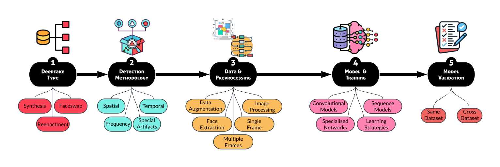

# Facial Deepfake Detectors
*Under Review.*

 
### I. Validate 16 Deepfake Detectors

For starting evaluation, please put the dataset in the `datasets` folder, and download the pre-trained weight from 16 respositories / papers and put into the `pretrained-weight` forlder.

For the methods: SBI, MAT, ICT, Rossler, ForgeryNet, Capsule Forensics, CADDM, CCViT, ADD, MCX, LGrad, Effb4Net, please use the following code for testing:

```
CUDA_VISIBLE_DEVICES="0" python ./detection/test.py  --model-name <method> --batch-size 128
```

Where the ` <method> ` is selected from (`selfblended`, `mat`, `ict`, `rossler`, `forgerynet`, `capsule`, `caddm`, `ccvit`, `add`, `mcx`, `lgrad`, `effb4att`)

For the methods:  FTCN, AltFreexing, LipForensics, LRNet, CLRNet, please refer to their respective folder and run the `test.py` or `test.ipynb`.

For Lgrad method: Please learn how to pre-process facial deepfake image datasets to gradient datasets and download pretrained GAN networks from their official repository before run the `test.py`.

### II. Datasets
#### 1. White-box datasets
Please email us to obtain the white-box dataset generated from popular deepfake apps and repos.
#### 2. Gray-box datasets
* CelebDFv2 [[Dataset]](https://cse.buffalo.edu/~siweilyu/celeb-deepfakeforensics.html)  [[Paper]](https://arxiv.org/abs/1909.12962) 
* DFDC [[Dataset]](https://www.kaggle.com/c/deepfake-detection-challenge)  [[Paper]](https://arxiv.org/abs/2006.07397) 
#### 2. Black-box dataset
* RWDF-23 [[Dataset]](https://sites.google.com/view/rwdf-23/) [[Paper]](https://dl.acm.org/doi/10.1145/3583780.3614729) 

### III. Evaluation Results (White- \& black-box)

|                      | ACC                                  |   ACC@best                               |   AUC       |   F1        |   Precision  |   Recall    |   ACC       |   ACC@best  |   AUC       |   F1        |   Precision  |   Recall    |
|----------------------|--------------------------------------------|------------------------------------------------|-------------------|-------------------|--------------------|-------------------|-------------------|-------------------|-------------------|-------------------|--------------------|-------------------|
||  Xceptionnet   |||||| Capsule Forensics   |
| DeepFaceLab          | 79.01                                      | 90.12                                          | 94.95             | 80.85             | 100.00             | 67.86             | 86.42             | 90.12             | 91.71             | 80.85             | 100.00             | 67.86             |
| Dfaker               | 66.67                                      | 71.60                                          | 66.58             | 51.06             | 63.16              | 42.86             | 83.95             | 87.65             | 86.73             | 76.60             | 94.74              | 64.29             |
| Faceswap             | 69.14                                      | 75.31                                          | 74.26             | 60.00             | 68.18              | 53.57             | 90.12             | 95.06             | 98.45             | 92.86             | 92.86              | 92.86             |
| FOM-Animation        | 65.43                                      | 65.43                                          | 35.31             | INF               | N/A                | 0.00              | 67.90             | 69.14             | 46.63             | 19.35             | 100.00             | 10.71             |
| FOM-Faceswap         | 65.43                                      | 65.43                                          | 35.65             | N/A               | N/A                | 0.00              | 70.37             | 70.37             | 55.93             | 25.00             | 100.00             | 14.29             |
| FSGAN                | 65.43                                      | 66.67                                          | 63.88             | 44.90             | 52.38              | 39.29             | 70.37             | 77.78             | 73.79             | 52.63             | 100.00             | 35.71             |
| LightWeight          | 67.90                                      | 72.84                                          | 73.11             | 54.17             | 65.00              | 46.43             | 90.12             | 93.83             | 98.25             | 88.00             | 100.00             | 78.57             |
|            | 68.43  (4.88)                             | 72.49  (8.69)                                 | 63.39  (21.51)   | 58.20  (13.79)   | 69.74  (17.93)    | 35.72  (26.08)   | 79.89  (9.95)    | 83.42  (10.90)   | 78.78  (20.72)   | 62.18  (30.20)   | 98.23  (3.07)     | 52.04  (32.07)   |
|    **In-the-wild** | 27.06                                      | 72.94                                          | 39.45             | 84.35             | 72.94              | 100.00            | 30.27             | 72.94             | 49.78             | 84.26             | 73.19              | 99.28             |
||    FTCN          ||||||  LRNet    |  
| DeepFaceLab          | 88.89                                      | 93.83                                          | 97.71             | 90.91             | 92.59              | 89.29             | 58.02             | 65.43             | 54.78             | N/A               | N/A                | 0.00              |
| Dfaker               | 88.89                                      | 93.83                                          | 97.71             | 91.23             | 89.66              | 92.86             | 65.43             | 69.14             | 69.88             | 63.77             | 53.66              | 78.57             |
| Faceswap             | 91.36                                      | 95.06                                          | 98.52             | 92.86             | 92.86              | 92.86             | 64.20             | 70.37             | 71.39             | 50.00             | 60.00              | 42.86             |
| FOM-Animation        | 91.36                                      | 97.53                                          | 99.66             | 96.55             | 93.33              | 100.00            | 58.02             | 65.43             | 59.10             | N/A               | N/A                | 0.00              |
| FOM-Faceswap         | 91.36                                      | 96.30                                          | 99.19             | 94.92             | 90.32              | 100.00            | 58.02             | 65.43             | 58.89             | N/A               | N/A                | 0.00              |
| FSGAN                | 90.12                                      | 95.06                                          | 97.51             | 93.10             | 90.00              | 96.43             | 64.20             | 65.43             | 63.11             | N/A               | N/A                | 0.00              |
| LightWeight          | 91.36                                      | 95.06                                          | 98.32             | 92.86             | 92.86              | 92.86             | 64.20             | 71.60             | 72.98             | 69.33             | 55.32              | 92.86             |
|    **Avg.**         | 90.48  (1.17)                             | 95.24  (1.32)                                 | 98.37  (0.81)    | 93.20  (1.98)    | 91.66  (1.59)     | 94.90  (4.05)    | 61.73  (3.49)    | 67.55  (2.73)    | 64.30  (7.13)    | 61.03  (9.95)    | 56.33  (3.29)     | 30.61  (40.97)   |
|    **In-the-wild** | 41.35                                      | 72.89                                          | 58.30             | 84.21             | 72.96              | 99.56             | 39.13             | 76.95             | 48.48             | 86.97             | 76.95              | 100.00            |
|                      |     MAT       ||||||  CLRNet              |
| DeepFaceLab          | 55.56                                      | 92.59                                          | 97.17             | 89.29             | 89.29              | 89.29             | 74.12             | 76.47             | 81.68             | 82.46             | 79.66              | 85.45             |
| Dfaker               | 55.56                                      | 87.65                                          | 91.37             | 82.54             | 74.29              | 92.86             | 74.12             | 74.71             | 77.65             | 81.86             | 76.38              | 88.18             |
| Faceswap             | 55.56                                      | 91.36                                          | 96.16             | 85.71             | 85.71              | 85.71             | 78.24             | 80.59             | 85.32             | 85.46             | 82.91              | 88.18             |
| FOM-Animation        | 54.32                                      | 85.19                                          | 88.54             | 76.00             | 86.36              | 67.86             | 61.18             | 64.71             | 61.85             | 78.57             | 64.71              | 100.00            |
| FOM-Faceswap         | 54.32                                      | 86.42                                          | 88.88             | 79.25             | 84.00              | 75.00             | 64.71             | 65.88             | 66.59             | 75.42             | 70.63              | 80.91             |
| FSGAN                | 54.32                                      | 79.01                                          | 83.42             | 72.13             | 66.67              | 78.57             | 71.18             | 71.18             | 71.95             | 78.03             | 76.99              | 79.09             |
| LightWeight          | 55.56                                      | 91.36                                          | 95.62             | 83.02             | 88.00              | 78.57             | 77.06             | 79.41             | 83.67             | 84.72             | 81.51              | 88.18             |
|    **Avg.**         | 55.03  (0.66)                             | 87.65  (4.73)                                 | 91.59  (5.03)    | 81.13  (5.83)    | 82.05  (8.37)     | 81.12  (8.68)    | 71.52  (6.36)    | 73.28  (6.27)    | 75.53  (8.98)    | 80.93  (3.71)    | 76.11  (6.44)     | 87.14  (6.77)    |
|    **In-the-wild** | 71.26                                      | 73.73                                          | 68.93             | 84.40             | 74.46              | 97.40             | 58.32             | 72.87             | 55.25             | N/A               | N/A                | 0.00              |
||      SBIs          ||||||  ICT                 |
| DeepFaceLab          | 65.43                                      | 95.06                                          | 98.05             | 93.10             | 90.00              | 96.43             | -                 | 71.60             | 64.15             | 29.41             | 83.33              | 17.86             |
| Dfaker               | 65.43                                      | 85.19                                          | 90.30             | 81.82             | 71.05              | 96.43             | -                 | 71.60             | 67.25             | 33.33             | 75.00              | 21.43             |
| Faceswap             | 65.43                                      | 92.59                                          | 96.50             | 87.27             | 88.89              | 85.71             | -                 | 70.37             | 67.52             | 29.41             | 83.33              | 17.86             |
| FOM-Animation        | 43.21                                      | 65.43                                          | 37.47             | N/A               | N/A                | 0.00              | -                 | 65.43             | 47.91             | N/A               | N/A                | 0.00              |
| FOM-Faceswap         | 54.32                                      | 65.43                                          | 58.69             | N/A               | N/A                | 0.00              | -                 | 65.43             | 60.04             | N/A               | N/A                | 0.00              |
| FSGAN                | 65.43                                      | 83.95                                          | 90.03             | 78.69             | 72.73              | 85.71             | -                 | 66.67             | 56.00             | 6.90              | 100.00             | 3.57              |
| LightWeight          | 65.43                                      | 92.59                                          | 96.50             | 85.19             | 88.46              | 82.14             | -                 | 70.37             | 66.37             | 29.41             | 83.33              | 17.86             |
|    **Avg.**         | 60.67  (8.74)                             | 82.89  (12.60)                                | 81.08  (23.56)   | 85.21  (5.49)    | 82.23  (9.47)     | 63.77  (43.91)   | -                 | 68.78  (2.82)    | 60.33  (7.42)    | 25.69  (10.64)   | 85.00  (9.13)     | 11.23  (9.55)    |
|    **In-the-wild** | 41.51                                      | 73.05                                          | 55.27             | 84.41             | 73.02              | 100.00            | -                 | 88.30             | 61.32             | N/A               | N/A                | 0.00              |
||      CADDM        ||||||  MCX-API             |
| DeepFaceLab          | 61.73                                      | 87.65                                          | 93.67             | 82.14             | 82.14              | 82.14             | 34.57             | 65.43             | 47.37             | N/A               | N/A                | 0.00              |
| Dfaker               | 61.73                                      | 79.01                                          | 85.92             | 58.54             | 92.31              | 42.86             | 35.80             | 69.14             | 52.36             | 28.57             | 71.43              | 17.86             |
| Faceswap             | 61.73                                      | 88.89                                          | 92.52             | 82.35             | 91.30              | 75.00             | 65.43             | 67.90             | 48.11             | 13.33             | 100.00             | 7.14              |
| FOM-Animation        | 37.04                                      | 66.67                                          | 30.26             | 12.90             | 66.67              | 7.14              | 65.43             | 65.43             | 41.58             | N/A               | N/A                | 0.00              |
| FOM-Faceswap         | 48.15                                      | 69.14                                          | 55.80             | 28.57             | 71.43              | 17.86             | 65.43             | 65.43             | 56.33             | N/A               | N/A                | 0.00              |
| FSGAN                | 43.21                                      | 65.43                                          | 46.83             | N/A               | N/A                | 0.00              | 65.43             | 70.37             | 62.20             | 29.41             | 83.33              | 17.86             |
| LightWeight          | 61.73                                      | 86.42                                          | 91.78             | 77.55             | 90.48              | 67.86             | 34.57             | 65.43             | 46.16             | 6.67              | 50.00              | 3.57              |
|    **Avg.**         | 53.62  (10.62)                            | 77.60  (10.39)                                | 70.97  (26.16)   | 57.01  (29.84)   | 82.39  (11.05)    | 41.84  (33.99)   | 52.38  (16.28)   | 67.02  (2.11)    | 50.19  (13.74)   | 19.50  (11.30)   | 76.19  (21.03)    | 6.63  (8.10)     |
|    **In-the-wild** | 42.56                                      | 72.94                                          | 60.40             | 84.35             | 72.97              | 99.93             | 72.63             | 73.02             | 55.59             | 83.93             | 73.96              | 97.02             |
||     AltFreezing  ||||||  LipForensics        |
| DeepFaceLab          | 83.95                                      | 90.12                                          | 95.22             | 86.21             | 83.33              | 89.29             | 61.21             | 57.59             | 88.93             | 28.09             | 35.90              | 23.08             |
| Dfaker               | 86.42                                      | 98.77                                          | 99.66             | 98.18             | 100.00             | 96.43             | 60.12             | 56.51             | 91.36             | 30.77             | 35.90              | 26.92             |
| Faceswap             | 86.42                                      | 98.77                                          | 99.80             | 98.18             | 100.00             | 96.43             | 60.12             | 56.51             | 89.14             | 30.77             | 35.90              | 26.92             |
| FOM-Animation        | 85.19                                      | 92.59                                          | 97.10             | 89.29             | 89.29              | 89.29             | 60.12             | 55.79             | 90.14             | 32.38             | 35.90              | 29.49             |
| FOM-Faceswap         | 86.42                                      | 93.83                                          | 97.24             | 91.80             | 84.85              | 100.00            | 61.21             | 56.51             | 89.86             | 30.77             | 35.90              | 26.92             |
| FSGAN                | 86.42                                      | 96.30                                          | 99.39             | 94.34             | 100.00             | 89.29             | 59.04             | 55.06             | 94.64             | 33.87             | 35.90              | 32.05             |
| LightWeight          | 86.42                                      | 98.77                                          | 99.66             | 98.18             | 100.00             | 96.43             | 60.12             | 54.34             | 91.71             | 35.24             | 35.90              | 34.62             |
|    **Avg.**         | 85.89  (0.97)                             | 95.59  (3.48)                                 | 98.30  (1.79)    | 93.74  (4.83)    | 93.92  (7.79)     | 93.88  (4.48)    | 60.28  (0.75)    | 56.04  (1.08)    | 90.83  (1.98)    | 31.70  (2.36)    | 35.90  (0.00)     | 28.57  (3.83)    |
|    **In-the-wild** | 43.46                                      | 72.63                                          | 60.24             | 84.12             | 72.67              | 99.85             | 36.25             | 71.83             | 58.65             | 83.48             | 72.94              | 97.57             |
||      LGrad      |||||| EffB4Att            |
| DeepFaceLab          | 65.43                                      | 65.43                                          | 37.06             | 22.22             | 50.00              | 14.29             | 55.56             | 65.43             | 23.72             | N/A               | N/A                | 0.00              |
| Dfaker               | 64.20                                      | 65.43                                          | 28.84             | N/A               | N/A                | 0.00              | 65.43             | 65.43             | 39.76             | N/A               | N/A                | 0.00              |
| Faceswap             | 66.67                                      | 71.60                                          | 52.96             | 34.29             | 85.71              | 21.43             | 65.43             | 72.84             | 76.82             | 38.89             | 87.50              | 25.00             |
| FOM-Animation        | 66.67                                      | 70.37                                          | 61.73             | 33.33             | 75.00              | 21.43             | 34.57             | 67.90             | 64.82             | 18.75             | 75.00              | 10.71             |
| FOM-Faceswap         | 65.43                                      | 66.67                                          | 40.36             | 6.9               | 100.00             | 3.57              | 66.67             | 81.48             | 83.89             | 75.41             | 69.70              | 82.14             |
| FSGAN                | 33.33                                      | 66.67                                          | 48.38             | 22.86             | 57.14              | 14.29             | 55.56             | 79.01             | 79.65             | 73.02             | 65.71              | 82.14             |
| LightWeight          | 34.57                                      | 65.43                                          | 56.81             | 22.22             | 50.00              | 14.29             | 66.67             | 72.84             | 73.72             | 60.71             | 60.71              | 60.71             |
|    **Avg.**         | 56.61  (15.51)                            | 67.37  (2.55)                                 | 13.91  (15.82)   | 23.64  (9.92)    | 69.64  (20.67)    | 12.76  (8.21)    | 58.56  (11.69)   | 72.13  (6.37)    | 38.11  (32.66)   | 53.36  (24.16)   | 71.72  (10.26)    | 37.24  (36.99)   |
|    **In-the-wild** | 72.47                                      | 72.63                                          | 47.78             | 84.14             | 72.63              | 100.00            | 21.61             | 79.84             | 45.05             | 88.77             | 79.81              | 100.00            |
||      CCViT       |||||| ADD                 |
| DeepFaceLab          | 87.65                                      | 96.30                                          | 99.33             | 94.74             | 93.10              | 96.43             | 100.00            | 100.00            | 100.00            | 100.00            | 100.00             | 100.00            |
| Dfaker               | 83.95                                      | 90.12                                          | 95.01             | 83.02             | 88.00              | 78.57             | 96.30             | 98.77             | 99.80             | 98.18             | 100.00             | 96.43             |
| Faceswap             | 86.42                                      | 95.06                                          | 98.65             | 94.74             | 93.10              | 96.43             | 100.00            | 100.00            | 100.00            | 100.00            | 100.00             | 100.00            |
| FOM-Animation        | 76.54                                      | 81.48                                          | 77.22             | 69.23             | 75.00              | 64.29             | 65.43             | 69.14             | 46.83             | 19.35             | 100.00             | 10.71             |
| FOM-Faceswap         | 80.25                                      | 85.19                                          | 86.59             | 76.92             | 83.33              | 71.43             | 65.43             | 70.37             | 45.15             | 29.41             | 83.33              | 17.86             |
| FSGAN                | 82.72                                      | 83.95                                          | 92.79             | 73.47             | 85.71              | 64.29             | 77.78             | 77.78             | 74.87             | 58.54             | 92.31              | 42.86             |
| LightWeight          | 87.65                                      | 95.06                                          | 98.99             | 92.86             | 92.86              | 92.86             | 100.00            | 100.00            | 100.00            | 100.00            | 100.00             | 100.00            |
|    **Avg.**         | 83.59  (4.14)                             | 89.59  (6.08)                                 | 92.65  (8.18)    | 83.57  (10.71)   | 87.30  (6.69)     | 80.61  (14.56)   | 86.42  (16.36)   | 88.01  (14.83)   | 80.95  (25.58)   | 72.21  (36.07)   | 96.52  (6.48)     | 66.84  (41.43)   |
|    **In-the-wild** | 62.87                                      | 72.94                                          | 66.10             | 84.35             | 72.94              | 100.00            | 33.49             | 73.73             | 49.76             | 84.42             | 74.41              | 97.54             |
